# Hyprkarl
Hyprkarl is a desktop configuration repo for CachyOS + Hyprland, inspired by
Omarchy. It is meant to be installed and then edited directly.

> **Warning:** The setup process is largely untested. Use at your own risk.

## Screenshots

<table>
  <tr>
    <td>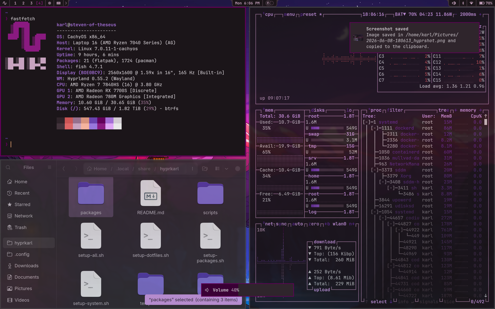<br/><sub>Busy desktop</sub></td>
    <td>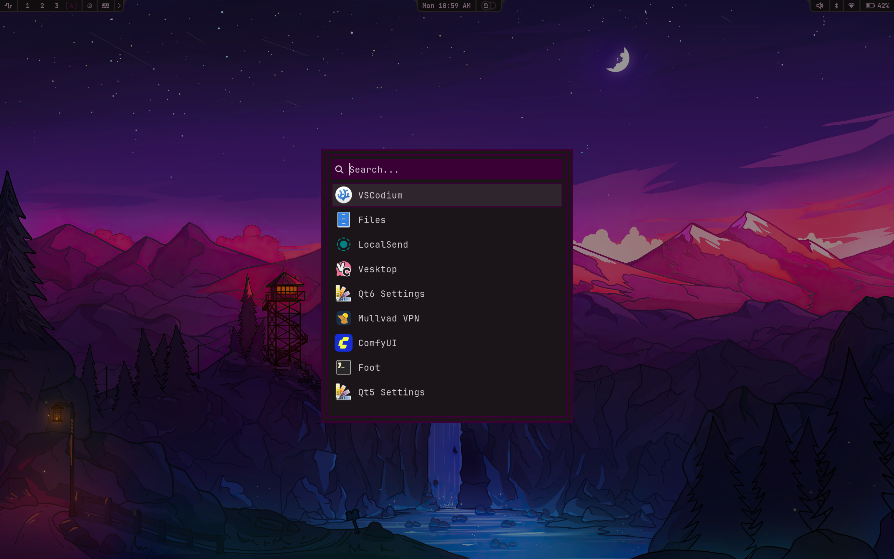<br/><sub>App launcher</sub></td>
  </tr>
  <tr>
    <td>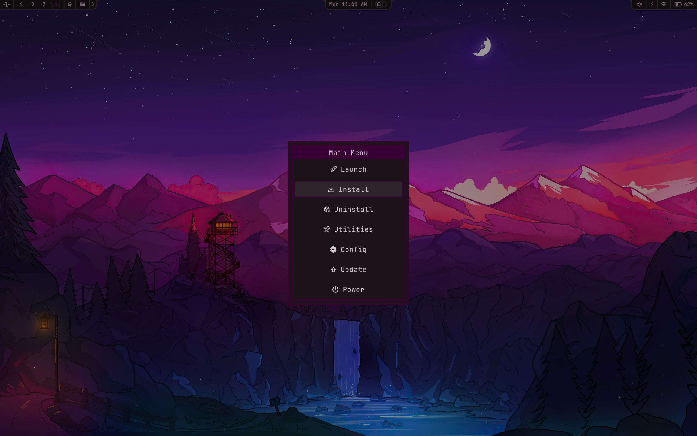<br/><sub>Hyprkarl menu</sub></td>
    <td>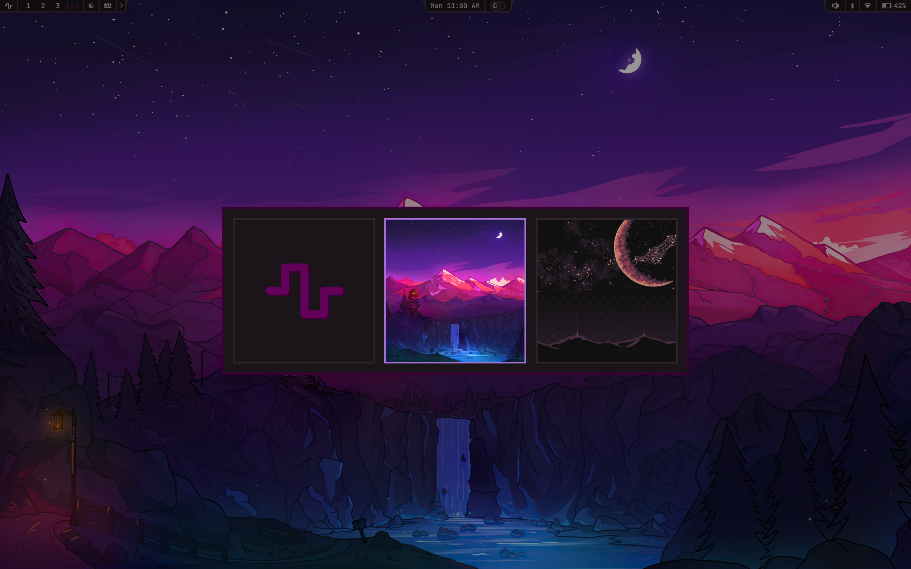<br/><sub>Wallpaper picker</sub></td>
  </tr>
</table>

## Requirements

- Base CachyOS (Hyprland) install
- Single-user. Hyprkarl does not try to support multi-user setups.
- Btrfs filesystem (with LUKS encryption) and Limine boot loader are strongly recommended. Hyprkarl may implement changes involving either one in the future.
- Hyprland must be running under UWSM (this is the default on CachyOS). SDDM autologin is configured to launch `hyprland-uwsm.desktop`.

## Warnings

- The setup script enables SDDM autologin. The intention is to rely on LUKS encryption for boot authentication instead of requiring two passwords. If you prefer to disable autologin, edit `setup-system.sh` before running it, or disable it manually afterward.
- Multi-user setups are not supported. You're on your own if you need one.

## Installation

Clone into `~/.local/share/` and run the setup script:

```bash
git clone --depth=1 https://github.com/KarlJussila/hyprkarl.git ~/.local/share/hyprkarl
cd ~/.local/share/hyprkarl
./setup-all.sh
```

> **Warning:** If you already have configs you care about in `~/.config/` or
> `~/.local/share/applications/`, back them up first. `setup-dotfiles.sh`
> replaces overlapping live files with symlinks to Hyprkarl.

## After Installation

Hyprkarl's configs and scripts live in `~/.local/share/hyprkarl/`. The live
files under `~/.config/` and `~/.local/share/applications/` are usually
symlinks back into that tree, so edit the files in Hyprkarl itself.

A few things worth knowing:

- create a git branch before customizing
- updates are normal git merges, not a special Hyprkarl workflow
- user environment variables live in `~/.config/uwsm/`
  and require a new session to take effect

## Documentation

The full manual lives under `docs/`.

- [docs/README.md](docs/README.md)
  Manual index
- [docs/getting-started.md](docs/getting-started.md)
  Installation, symlink model, updating, and restart boundaries
- [docs/using-hyprkarl.md](docs/using-hyprkarl.md)
  Daily workflow: menus, keybindings, themes, wallpapers, defaults, and
  utilities
- [docs/configuration-map.md](docs/configuration-map.md)
  Repo layout and main editing surfaces
- [docs/themes.md](docs/themes.md)
  Theme structure, wallpaper layout, and theme switching
- [docs/customizing-bar.md](docs/customizing-bar.md)
  Bar widget layout, styling, and runtime control
- [docs/extending-hyprkarl.md](docs/extending-hyprkarl.md)
  Adding commands, menus, keybindings, and theme-aware config
- [docs/troubleshooting.md](docs/troubleshooting.md)
  Common setup and runtime failures
- [docs/commands.md](docs/commands.md)
  Command reference
- [docs/repo-conventions.md](docs/repo-conventions.md)
  Editing conventions, stowed-config model, stateful paths
- [docs/shell-style.md](docs/shell-style.md)
  Hyprkarl's shell scripting style

## Themes

Themes live under `themes/` and control the appearance of Hyprland, the AGS
bar, rofi, terminals, mako, hyprlock, and other applications.

Switch themes from `Hyprkarl Menu -> Config -> Theme` or with:

```bash
hk-theme set <theme-name>
```

To build your own theme, either generate one from a color palette with
[hyprkarl-theme-generator](https://github.com/KarlJussila/hyprkarl-theme-generator)
(recommended) or copy an existing theme directory and edit it. See
[docs/themes.md](docs/themes.md) for both approaches and the full theme layout.

Provided themes:
<details>
<summary>hyprkarl</summary>

<table>
  <tr>
    <td><br/><sub>Busy desktop</sub></td>
    <td><br/><sub>App launcher</sub></td>
  </tr>
  <tr>
    <td><br/><sub>Hyprkarl menu</sub></td>
    <td><br/><sub>Wallpaper picker</sub></td>
  </tr>
</table>

</details>

<details>
<summary>everforest</summary>

<table>
  <tr>
    <td>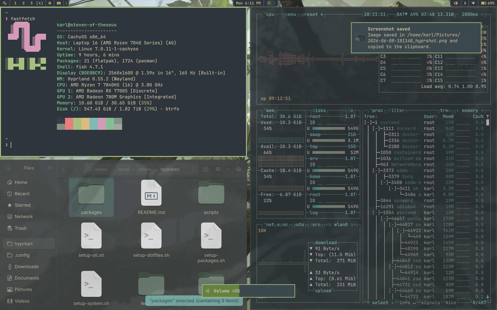<br/><sub>Busy desktop</sub></td>
    <td>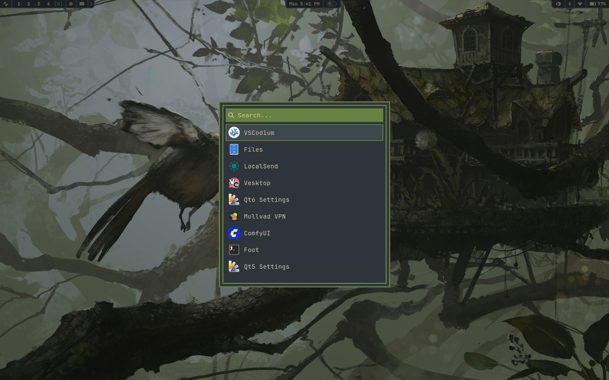<br/><sub>App launcher</sub></td>
  </tr>
  <tr>
    <td>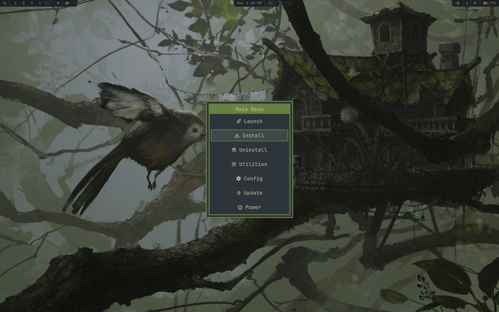<br/><sub>Hyprkarl menu</sub></td>
    <td>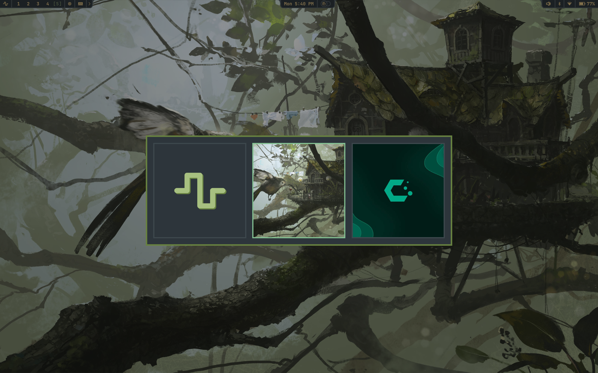<br/><sub>Wallpaper picker</sub></td>
  </tr>
</table>

</details>

<details>
<summary>gruvbox</summary>

<table>
  <tr>
    <td>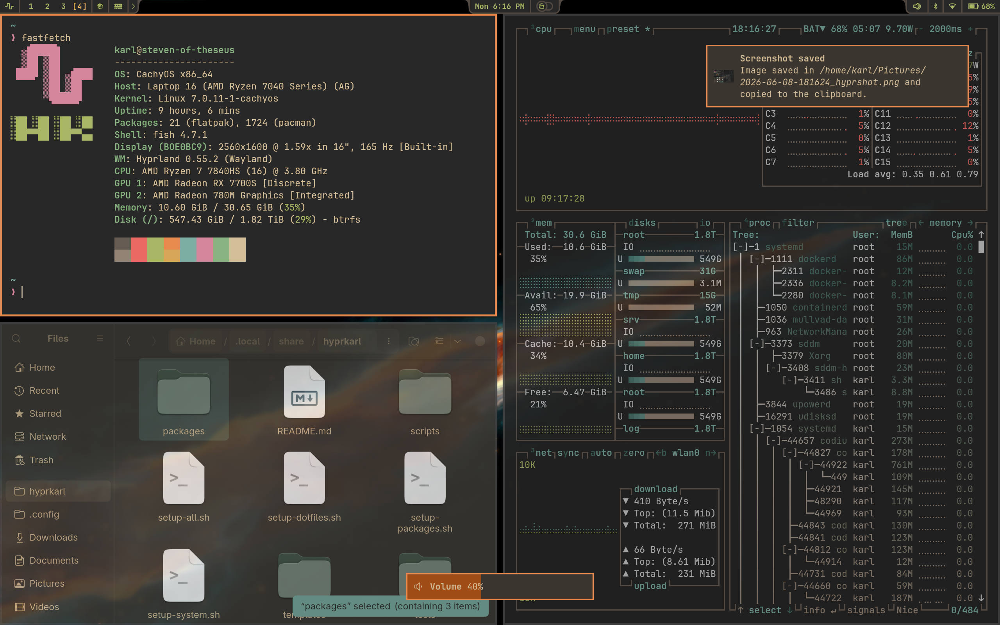<br/><sub>Busy desktop</sub></td>
    <td>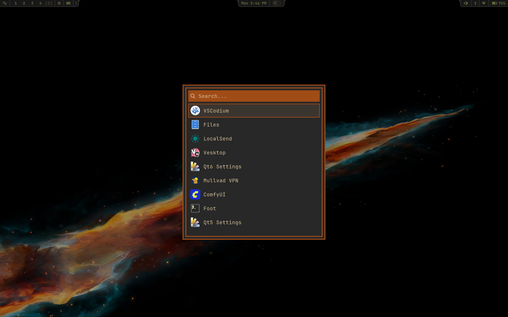<br/><sub>App launcher</sub></td>
  </tr>
  <tr>
    <td>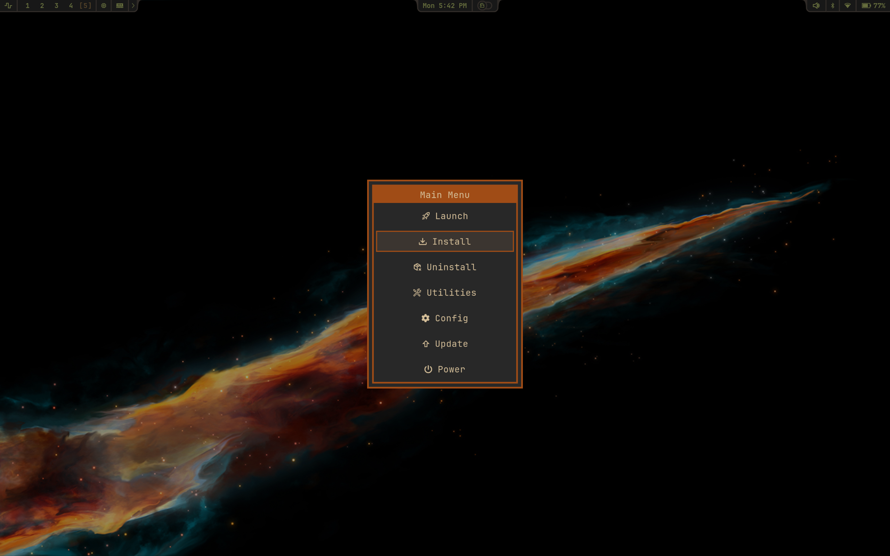<br/><sub>Hyprkarl menu</sub></td>
    <td>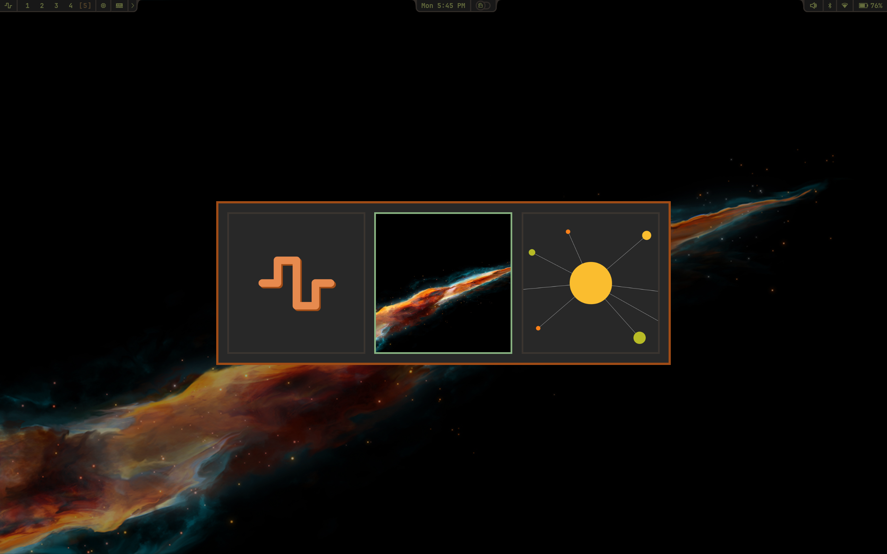<br/><sub>Wallpaper picker</sub></td>
  </tr>
</table>

</details>

## Keybindings

These are the basic keybindings to get you started. You can search the rest in
the keybindings menu or edit them in `config/hypr/bindings/`.

```
SUPER + K              ->  Searchable list of keybinds
SUPER + ALT + SPACE    ->  Hyprkarl menu
SUPER + SPACE          ->  App launcher
SUPER + SHIFT + F      ->  File manager (yazi)
SUPER + ENTER          ->  Terminal
SUPER + [0-9]          ->  Navigate to workspace
SUPER + SHIFT + [0-9]  ->  Move window to workspace
SUPER + F              ->  Fullscreen
SUPER + T              ->  Toggle tiling/floating
```

## Updating

If you have customized Hyprkarl, update it like a normal git branch. Review
upstream changes before merging them, and commit your own work first,
especially changes under `config/` and `applications/`.

For the full update workflow, including when to run `hk-update`,
`setup-packages.sh`, `setup-system.sh`, or `setup-dotfiles.sh`, see
[docs/getting-started.md](docs/getting-started.md) and
[docs/updating.md](docs/updating.md).
