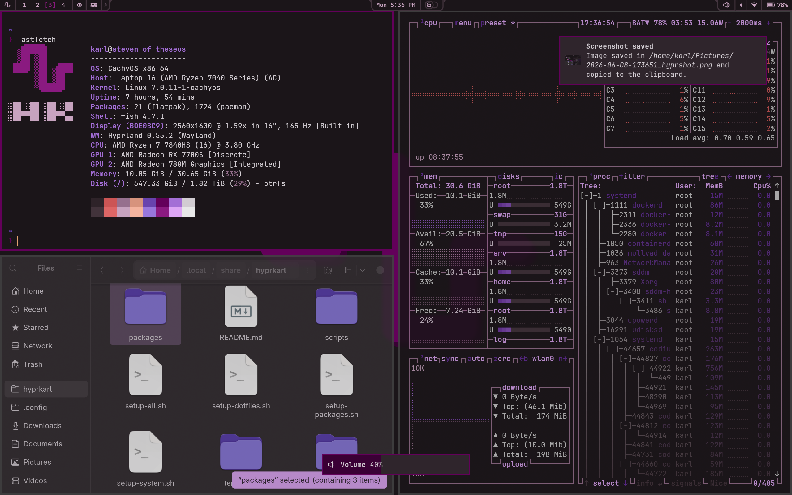
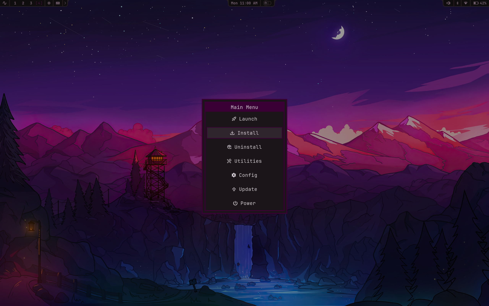
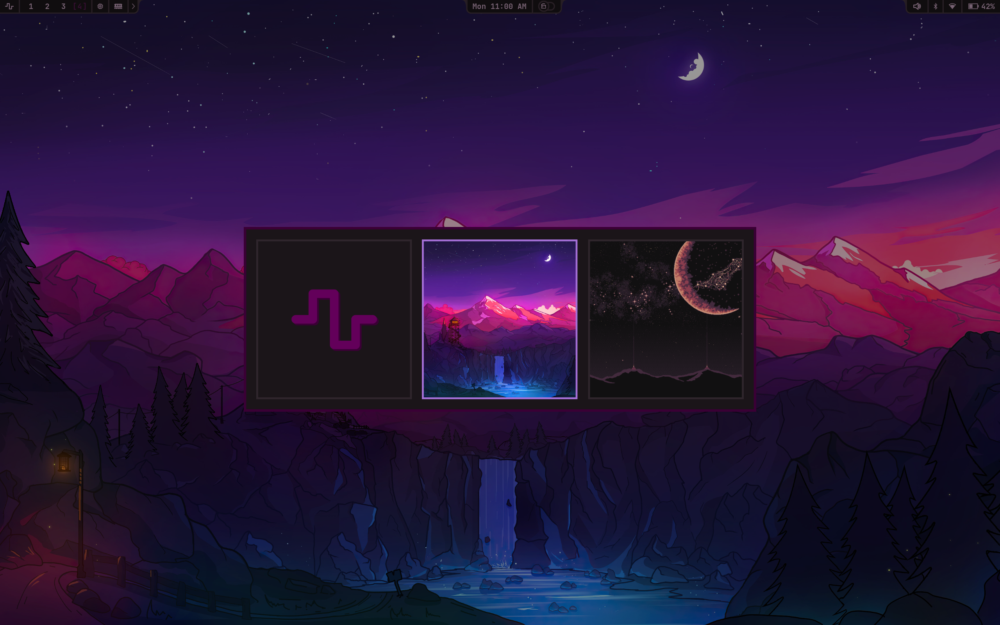
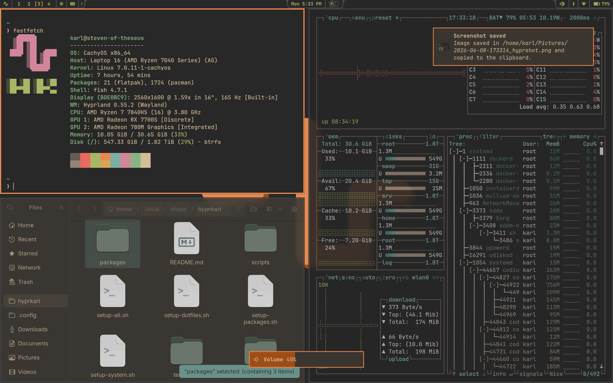
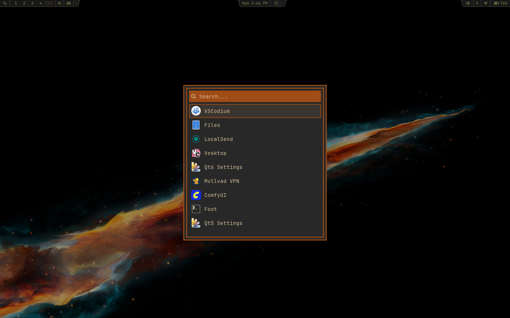

# Hyprkarl
Hyprkarl is a desktop configuration repo for CachyOS + Hyprland, inspired by
Omarchy. It supplies a complete default system while keeping ordinary personal
configuration outside the checkout.

> **Warning:** The fresh-install path (`setup-*.sh` on a new machine) is
> largely untested — the running system it produces is daily-driven, but the
> first-run setup itself is not. Review the scripts before running them, and
> use at your own risk.

## Screenshots

<table>
  <tr>
    <td><br/><sub>Busy desktop</sub></td>
    <td><br/><sub>App launcher</sub></td>
  </tr>
  <tr>
    <td><br/><sub>Hyprkarl menu</sub></td>
    <td><br/><sub>Wallpaper picker</sub></td>
  </tr>
</table>

## Requirements

- Base CachyOS (Hyprland) install
- Single-user. Hyprkarl does not try to support multi-user setups.
- Btrfs filesystem (with LUKS encryption) and Limine boot loader are strongly recommended. Hyprkarl may implement changes involving either one in the future.
- Hyprland must be running under UWSM (this is the default on CachyOS). SDDM autologin is configured to launch `hyprland-uwsm.desktop`.

## Warnings

- The setup script enables SDDM autologin. The intention is to rely on LUKS encryption for boot authentication instead of requiring two passwords. If you prefer to disable autologin, edit `setup-system.sh` before running it, or disable it manually afterward.
- Multi-user setups are not supported. You're on your own if you need one.

## Installation

Clone into `~/.local/share/` and run the setup script:

```bash
git clone --depth=1 https://github.com/KarlJussila/hyprkarl.git ~/.local/share/hyprkarl
cd ~/.local/share/hyprkarl
./setup-all.sh
```

> **Note:** CachyOS's Hyprland edition now ships the Noctalia shell
> (`cachyos-hypr-noctalia`) by default, which conflicts with hyprkarl.
> `setup-all.sh` runs `setup-purge-noctalia.sh` first to remove it — it will
> ask for confirmation and is a no-op if Noctalia isn't installed.

> **Warning:** If you already have configs you care about in `~/.config/` or
> `~/.local/share/applications/`, back them up first. `setup-dotfiles.sh`
> replaces overlapping live files with symlinks to Hyprkarl.

## Uninstalling

```bash
~/.local/share/hyprkarl/uninstall.sh
```

Removes all of Hyprkarl's config symlinks (reversing `setup-dotfiles.sh`).
Installed packages and `setup-system.sh` changes are left in place; the script
lists them so you can undo what you want manually.

## After Installation

Hyprkarl's shipped configs and scripts live in `~/.local/share/hyprkarl/`.
Their live entry points are usually symlinks back into that tree. Personal
Hyprkarl configuration lives under
`${XDG_CONFIG_HOME:-$HOME/.config}/hyprkarl/`; normal personal commands belong
in `~/.local/bin/`.

A few things worth knowing:

- no Git branch is needed for ordinary personalization
- use a fork branch only when changing Hyprkarl's shipped implementation
- user environment variables and session defaults live in `~/.config/uwsm/`
  and require a new session to take effect

## Documentation

The full manual lives under `docs/`.

- [docs/README.md](docs/README.md)
  Manual index
- [docs/getting-started.md](docs/getting-started.md)
  Installation, symlink model, updating, and restart boundaries
- [docs/using-hyprkarl.md](docs/using-hyprkarl.md)
  Daily workflow: menus, keybindings, themes, wallpapers, defaults, and
  utilities
- [docs/configuration-map.md](docs/configuration-map.md)
  Repo layout and main editing surfaces
- [docs/themes.md](docs/themes.md)
  Theme structure, wallpaper layout, and theme switching
- [docs/customizing-bar.md](docs/customizing-bar.md)
  Bar widget layout, styling, and runtime control
- [docs/extending-hyprkarl.md](docs/extending-hyprkarl.md)
  Adding commands, menus, keybindings, and theme-aware config
- [docs/troubleshooting.md](docs/troubleshooting.md)
  Common setup and runtime failures
- [docs/commands.md](docs/commands.md)
  Command reference
- [docs/repo-conventions.md](docs/repo-conventions.md)
  Editing conventions, stowed-config model, stateful paths
- [docs/shell-style.md](docs/shell-style.md)
  Hyprkarl's Bash/Python command scripting style
- [docs/architecture-roadmap.md](docs/architecture-roadmap.md)
  Completed shell-foundation work and the remaining architecture roadmap
- [docs/shell-product-brief.md](docs/shell-product-brief.md)
  Bar aesthetic, independent feature panels, and product direction
- [docs/shell-configuration.md](docs/shell-configuration.md)
  Shell JSON, extension lanes, and runtime-state ownership
- [docs/menu-configuration.md](docs/menu-configuration.md)
  Shell-native menu entries, user overrides, Python dynamic providers, and
  direct menu commands
- [docs/authentication-surfaces.md](docs/authentication-surfaces.md)
  Shell-native polkit ownership and the pinned-version lock-screen decision

## Themes

Shipped themes live under `themes/`; personal themes and overlays live under
`${XDG_CONFIG_HOME:-$HOME/.config}/hyprkarl/themes/`. Selection atomically assembles an immutable runtime bundle
under `${XDG_STATE_HOME:-$HOME/.local/state}/hyprkarl`, so switching never
edits tracked files. Quickshell watches the runtime selector and applies theme
switches without restarting. Built-ins are generated from typed `theme.yaml`
graphs whose strings, numbers, booleans, shared defaults, and arbitrary custom
structures can feed stable consumer values. The semantic `quickshell.json`
controls island corner shapes,
selective borders, and screen/outer/content margins as well as colors and
typography. It also provides the minimum height and widget padding; the tallest
widget determines one shared height for all islands. Inspect or manage the bar
with `hk-shell status`, `hk-shell logs`, and the other `hk-shell` lifecycle
commands. Volume, audio-output, microphone, display/keyboard brightness, and
media-key feedback use the same shell through a focused-monitor, click-through
OSD. The shell also owns desktop notifications, including focused-monitor
routing, progress, silence mode, one-item restore, bar-connected geometry, and
data-defined application icon overrides with user QML drawings; Mako is no
longer part of the session. Polkit privilege requests also use a focused,
theme-aware Quickshell prompt; the separate `hyprpolkitagent` process is no
longer part of the session. A per-output display panel controls internal
backlight brightness, scale, and output enablement through one persistent
`hk-display` backend; explicit personal Hyprland monitor rules still have the
final say. Personal command widgets can add bar readouts
without editing QML using one application-wide polling or persistent-stream
provider per widget ID. Static command buttons such as the main-menu trigger
use the same kind without starting a timer or process. More specialized
personal bar widgets can be explicitly loaded from
`${XDG_CONFIG_HOME:-$HOME/.config}/hyprkarl/quickshell/modules/` through a small per-bar context, without turning the
shell into a plugin platform. The built-in bar can also be disabled while the
other shell services stay active; one explicitly referenced application-wide
user QML root under `${XDG_CONFIG_HOME:-$HOME/.config}/hyprkarl/quickshell/` can compose replacement surfaces, consume open-ended theme data,
and publish reactive notification positioning for a custom bar.
The app launcher, open-with chooser, calculator, and wallpaper picker are also
Quickshell-native. They share the shell's focused-overlay frame and interaction
model while keeping application, calculation, and wallpaper behavior in small
feature-owned implementations. Open-with can optionally set the selected
application as the MIME default before launching the file.

Switch themes from `Hyprkarl Menu -> Config -> Theme` or with:

```bash
hk-theme set <theme-name>
```

To build your own theme, create a typed source and generate it into
`${XDG_CONFIG_HOME:-$HOME/.config}/hyprkarl/themes/` with
`hk-theme build <source> [name]` and the adjacent
[hyprkarl-theme-generator](https://github.com/KarlJussila/hyprkarl-theme-generator)
(recommended), or copy an existing bundle there and edit it. See
[docs/themes.md](docs/themes.md) for both approaches and the full theme layout.

Provided themes:
<details>
<summary>hyprkarl</summary>

<table>
  <tr>
    <td><br/><sub>Busy desktop</sub></td>
    <td><br/><sub>App launcher</sub></td>
  </tr>
  <tr>
    <td><br/><sub>Hyprkarl menu</sub></td>
    <td><br/><sub>Wallpaper picker</sub></td>
  </tr>
</table>

</details>

<details>
<summary>everforest</summary>

<table>
  <tr>
    <td><br/><sub>Busy desktop</sub></td>
    <td><br/><sub>App launcher</sub></td>
  </tr>
  <tr>
    <td><br/><sub>Hyprkarl menu</sub></td>
    <td><br/><sub>Wallpaper picker</sub></td>
  </tr>
</table>

</details>

<details>
<summary>gruvbox</summary>

<table>
  <tr>
    <td><br/><sub>Busy desktop</sub></td>
    <td><br/><sub>App launcher</sub></td>
  </tr>
  <tr>
    <td><br/><sub>Hyprkarl menu</sub></td>
    <td><br/><sub>Wallpaper picker</sub></td>
  </tr>
</table>

</details>

## Keybindings

These are the basic keybindings to get you started. You can search the rest in
the keybindings menu. Personal additions and overrides belong in
`${XDG_CONFIG_HOME:-$HOME/.config}/hyprkarl/hypr/bindings.lua`; shipped bindings live under `defaults/hypr/bindings/`.

```
SUPER + K              ->  Searchable list of keybinds
SUPER + ALT + SPACE    ->  Hyprkarl menu
SUPER + SPACE          ->  App launcher
SUPER + SHIFT + F      ->  File manager (yazi)
SUPER + ENTER          ->  Terminal
SUPER + [0-9]          ->  Navigate to workspace
SUPER + SHIFT + [0-9]  ->  Move window to workspace
SUPER + F              ->  Fullscreen
SUPER + T              ->  Toggle tiling/floating
```

## Updating

Releases are annotated git tags (`vX.Y.Z`) on `main`; see
[CHANGELOG.md](CHANGELOG.md) for what changed in each.

Routine personalization lives outside the checkout under
`${XDG_CONFIG_HOME:-$HOME/.config}/hyprkarl/`, so it does not need a personal
Git branch. Create a fork branch only when changing Hyprkarl's shipped code or
defaults. Routine upstream updates do not edit personal files.

For the full update workflow, including when to run `hk-update`,
`setup-packages.sh`, `setup-system.sh`, or `setup-dotfiles.sh`, see
[docs/getting-started.md](docs/getting-started.md) and
[docs/updating.md](docs/updating.md).
